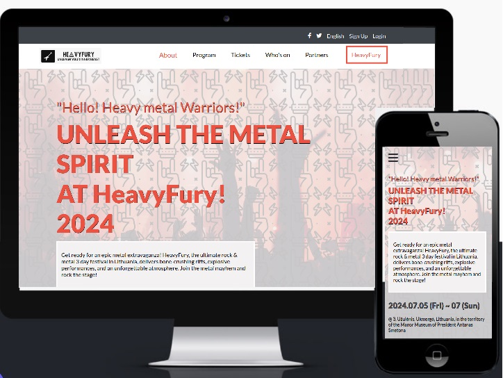

  
  
   

# 📗 Table of Contents

- [📖 About the Project](#about-project)
  - [🛠 Built With](#built-with)
    - [Tech Stack](#tech-stack)
    - [Key Features](#key-features)
  - [🚀 Live Demo](#live-demo)
- [💻 Getting Started](#getting-started)
- [👥 Authors](#authors)
- [🔭 Future Features](#future-features)
- [🤝 Contributing](#contributing)
- [⭐️ Show your support](#support)
- [🙏 Acknowledgements](#acknowledgements)
- [❓ FAQ (OPTIONAL)](#faq)
- [📝 License](#license)

# 📖 Music Festival Capstone Project 
 

 

#### ***Music Festival HeavyFury is a fictional festival, with fictional bands. Pictures are from a website pexels.com*** ####
 
This capstone project is a culmination of my first modules' learning journey. Solo project where I have applied the knowledge and skills acquired throughout my studies. With this web-page I am demonstrating my critical thinking, research, and problem-solving abilities.
 
 

## 🛠 Built With 
 

  
Page was built using HTML, CSS, JavaScript 
  part of the page (section called Headliners) dynamically, using Javascript

 

### Key Features 

 

- **Project has a set up for mobile first**
- **Project has verious desktop screen size set up**
- **Dynamically built HTML with JavaScript in order to be able to update it without re-writing whole HTML**

(<a href="#readme-top">back to top</a>)

## 🚀 Live Demo 
 

- [Click me to view deployed project!] (project is not deployed yet)

(<a href="#readme-top">back to top</a>)

## 💻 Getting Started 
 

A great project which can be used for almost anything, as it is made dynamically, so information can be updated or added through Javascript.

To get a local copy up and running, follow these steps:
 
- Choose a directory
- Open a Terminal
- write git clone https://github.com/agneta1991/Capstone_project
- get into to directory "Capstone Project"
- write: npm install

(<a href="#readme-top">back to top</a>)

## 👥 Author 
 

👤 **Agneta Pupienyte**

- GitHub: [@githubhandle](https://github.com/agneta1991)
- Twitter: [@twitterhandle](https://twitter.com/pupienytea)
- LinkedIn: [LinkedIn](https://www.linkedin.com/in/agneta-pupienyte-124a27256/?originalSubdomain=lt)

(<a href="#readme-top">back to top</a>)

## 🔭 Future Features 
 

-**In the future there will be some of the transitions and animations added to the page, to have more inviting vibe for the user**

(<a href="#readme-top">back to top</a>)

## 🤝 Contributing Contributions, issues, and feature requests are welcome!
 

Feel free to check the [issues page](https://github.com/agneta1991/Capstone-project/issues).

(<a href="#readme-top">back to top</a>)

## ⭐️ Show your support 
 

If you like my page please show your support and give this page a star!
 
 

(<a href="#readme-top">back to top</a>)

## 🙏 Acknowledgments 

 
I would like to extend my heartfelt gratitude to Microverse for providing me with the opportunity to undertake this capstone project. Additionally, I am immensely thankful to the code reviewers who took the time to assess my work and provide valuable feedback, which greatly contributed to the refinement and success of the project. Your guidance and support have been invaluable throughout this solo endeavor, and I am truly grateful for your contributions.

(<a href="#readme-top">back to top</a>)

 

## 📝 License 

This project is [MIT](./MIT.md) licensed.